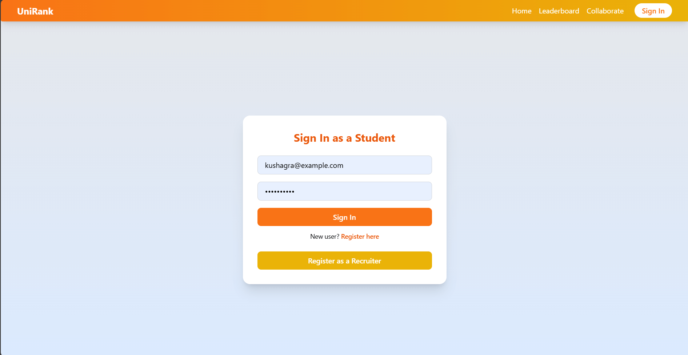
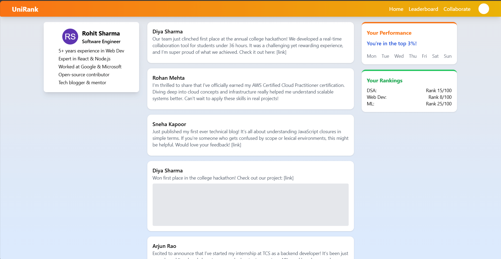
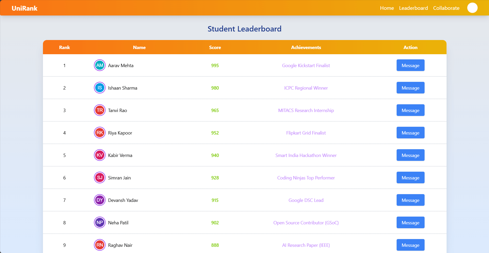
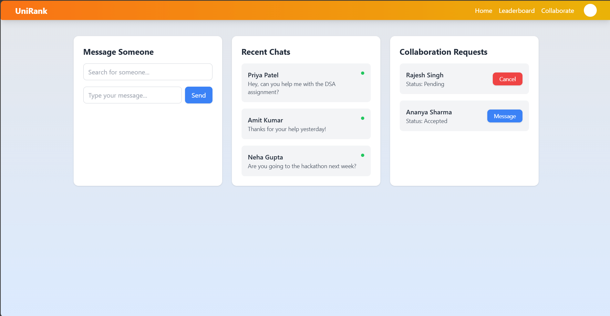
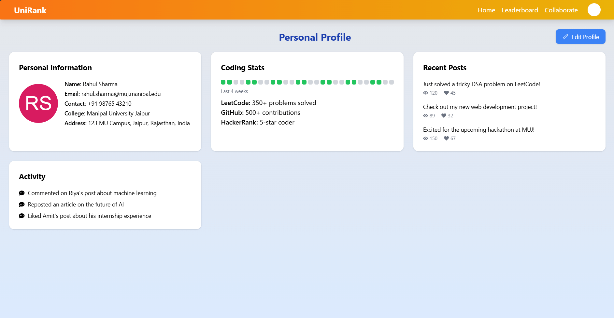
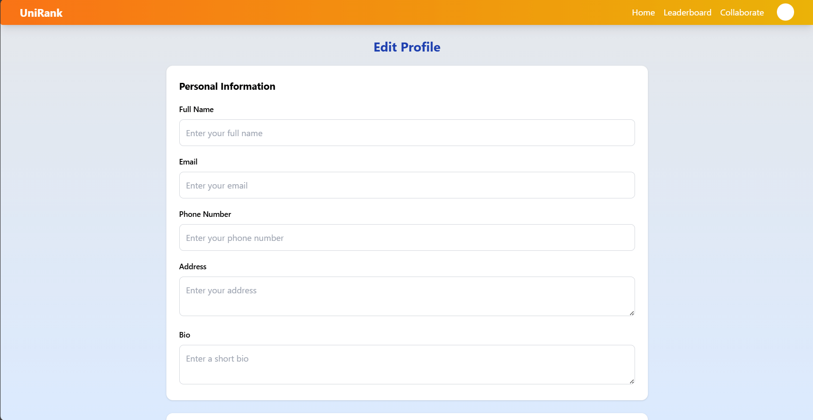

# 🎓 uniRank – Unified Platform for Streamlined College Placements & Collaboration

**Live Demo**: [uni-rank.vercel.app](https://uni-rank.vercel.app)

uniRank is a web application that empowers students by centralizing profiles, achievements, peer collaborations, and placement insights — all in one place. It bridges the gap between students, peers, and potential recruiters by providing a dynamic leaderboard and collaboration tools.

---

## 🚀 Features

- 🔐 **Authentication** – Secure login/signup using JWT.
- 🏠 **Home Page** – Overview of the platform with a three-column layout.
- 📊 **Leaderboard** – AI-powered ranking of students based on verified skills and achievements.
- 🤝 **Collaborate** – Send requests and chat with like-minded peers.
- 👤 **Profiles** – Showcase skills, achievements, and social links.
- 📝 **Edit Profile** – Personalized editing for skills, profile photo, bio, and more.

---

## 🧪 Tech Stack

| Tech         | Usage                                       |
|--------------|----------------------------------------------|
| **React.js** | Frontend architecture                       |
| **Tailwind CSS** | Styling and responsive design             |
| **HTML**     | Markup foundation                          |
| **JWT**      | Secure user authentication                  |
| **MongoDB**  | NoSQL database for storing user data        |
| **Express.js** | Backend API framework                |

> Note: The project is under active development. More integrations are coming soon!

---

## 🖼️ Screenshots

### 🔐 Login / Signup Page  

### 🏠 Home Page  

### 📊 Leaderboard Page  

### 🤝 Collaborate Page  

### 👤 Profile Page  

### 📝 Edit Profile Page  

---

### ⭐ Show your support
If you like this project, give it a ⭐ on GitHub — it motivates me to build more!